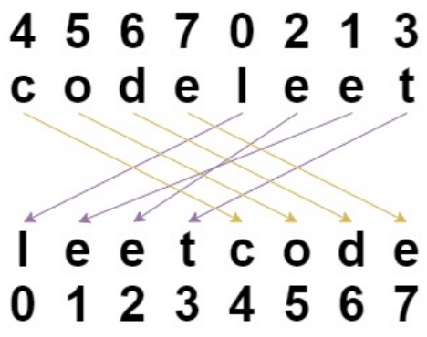

## 문자열 셔플

문자열 `s`와 같은 길이의 정수 배열 `indices`가 주어집니다. 
문자열 `s`는 셔플되어 $`i{th}`$번째 위치의 문자가 셔플된 문자열에서 `indices[i]` 위치로 이동합니다. 셔플된 문자열을 반환하세요.

### 예제 1:

- **입력**: `s = "codeleet"`, `indices = [4,5,6,7,0,2,1,3]`
- **출력**: `"leetcode"`
- **설명**: 위 그림과 같이, "codeleet"는 셔플 후 "leetcode"가 됩니다.

### 예제 2:
- **입력**: `s = "abc"`, `indices = [0,1,2]`
- **출력**: `"abc"`
- **설명**: 셔플 후 각 문자는 자신의 위치에 그대로 남아 있습니다.

### 제약 조건:
- `s.length == indices.length == n`
- `1 <= n <= 100`
- `s`는 소문자 영어 문자로만 구성됩니다.
- `0 <= indices[i] < n`
- `indices`의 모든 값은 유일합니다.
