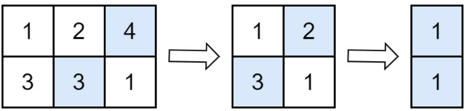
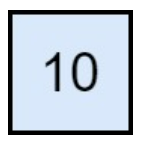

## 문제 설명

m x n 크기의 양의 정수로 이루어진 행렬 `grid`가 주어집니다. 다음의 작업을 `grid`가 비어있을 때까지 수행하세요:

1. 각 행에서 가장 큰 값을 삭제합니다. 만약 여러 개의 동일한 값이 존재한다면, 그 중 아무거나 삭제합니다.
2. 삭제된 값들 중 최대값을 답에 더합니다.
3. 각 작업 후 열의 수는 하나씩 줄어듭니다.

위 작업을 모두 수행한 후의 답을 반환하세요.

## 예제

### 예제 1

- **입력**: `grid = [[1,2,4],[3,3,1]]`
- **출력**: `8`
- **설명**: 
  - 첫 번째 작업에서 첫 번째 행에서 4를, 두 번째 행에서 3을 삭제합니다. 답에 4를 더합니다.
  - 두 번째 작업에서 첫 번째 행에서 2를, 두 번째 행에서 3을 삭제합니다. 답에 3을 더합니다.
  - 세 번째 작업에서 첫 번째 행에서 1을, 두 번째 행에서 1을 삭제합니다. 답에 1을 더합니다.
  - 최종 답 = 4 + 3 + 1 = 8

### 예제 2

- **입력**: `grid = [[10]]`
- **출력**: `10`
- **설명**: 
  - 첫 번째 작업에서 첫 번째 행에서 10을 삭제합니다. 답에 10을 더합니다.
  - 최종 답 = 10

## 예제 3:
- **입력:** `grid = [[1,3,5,7],[2,4,6,8],[3,5,7,9],[4,6,8,10],[50,35,15,39],[44,53,21,33],[11,22,44,33]]`
- **출력:** `150`
- **설명:** 위의 다이어그램은 각 단계에서 제거된 값을 보여줍니다.
  - 첫 번째 작업에서, 각 행에서 가장 큰 값을 제거합니다:
    - 첫 번째 행에서 7을 제거합니다. grid[0]
    - 두 번째 행에서 8을 제거합니다. grid[1]
    - 세 번째 행에서 9를 제거합니다. grid[2]
    - 네 번째 행에서 10을 제거합니다. grid[3]
    - 다섯 번째 행에서 50을 제거합니다. grid[4]
    - 여섯 번째 행에서 53을 제거합니다. grid[5]
    - 일곱 번째 행에서 44를 제거합니다. grid[6]
    - 제거된 값 중 최대값은 53입니다. 53을 답에 더합니다.
  - 두 번째 작업에서, 각 행에서 가장 큰 값을 제거합니다:
    - 첫 번째 행에서 5를 제거합니다.
    - 두 번째 행에서 6을 제거합니다.
    - 세 번째 행에서 7을 제거합니다.
    - 네 번째 행에서 8을 제거합니다.
    - 다섯 번째 행에서 39를 제거합니다.
    - 여섯 번째 행에서 44를 제거합니다.
    - 일곱 번째 행에서 33을 제거합니다.
    - 제거된 값 중 최대값은 44입니다. 44를 답에 더합니다.
  - 세 번째 작업에서, 각 행에서 가장 큰 값을 제거합니다:
    - 첫 번째 행에서 3을 제거합니다.
    - 두 번째 행에서 4를 제거합니다.
    - 세 번째 행에서 5를 제거합니다.
    - 네 번째 행에서 6을 제거합니다.
    - 다섯 번째 행에서 35를 제거합니다.
    - 여섯 번째 행에서 33을 제거합니다.
    - 일곱 번째 행에서 22를 제거합니다.
    - 제거된 값 중 최대값은 35입니다. 35를 답에 더합니다.
  - 네 번째 작업에서, 각 행에서 가장 큰 값을 제거합니다:
    - 첫 번째 행에서 1을 제거합니다.
    - 두 번째 행에서 2를 제거합니다.
    - 세 번째 행에서 3을 제거합니다.
    - 네 번째 행에서 4를 제거합니다.
    - 다섯 번째 행에서 15를 제거합니다.
    - 여섯 번째 행에서 21을 제거합니다.
    - 일곱 번째 행에서 11을 제거합니다.
    - 제거된 값 중 최대값은 21입니다. 21을 답에 더합니다.
  - 최종 답 = 53 + 44 + 35 + 21 = 153

## 제약 조건

- `m == grid.length`
- `n == grid[i].length`
- `1 <= m, n <= 50`
- `1 <= grid[i][j] <= 100`