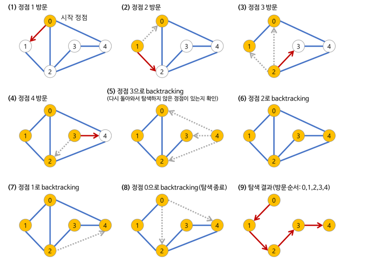

# DFS (Depth-first search)
## 깊이 우선 탐색
- 그래프 완전 탐색 방법 중 하나  
- 그래프의 시작 노드에서 출발하여 탐색할 한 쪽 분기를 정하여 최대 깊이까지 탐색을 마친 후 다른 쪽 분기로 이동하여 다시 탐색을 수행하는 알고리즘  
- 실제 구현 시 재귀함수를 이용하므로 스택 오버 플로 주의!!
- 응용하여 풀 수 있는 문제는 단절점 찾기, 단절선 찾기, 사이클 찾기, 위상 정렬 등
- 루트 노드(혹은 다른 임의의 노드)에서 시작해서 다음 분기(branch)로 넘어가기 전에 해당 분기를 완벽하게 탐색하는 방법
- 사용하는 경우: 모든 노드를 방문 하고자 하는 경우
- 단순 검색 속도 자체는 너비 우선 탐색(BFS)에 비해서 느립니다
- DFS는 한 번 방문한 노드를 다시 방문하면 안되므로 노드 방문 여부를 체크할 배열이 필요하며, 그래프는 인접 리스트로 표현
- DFS의 탐색 방식은 후입선출 특성을 가지므로 스택을 사용

| 기능       | 특징 | 시간 복잡도       |
|----------|---|--------------|
| 그래프 완전 탐 | 재귀 함수로 구현 , 스택 자료 구조 이용  | O(노드수 + 에지수) |

## 특징
1. 순환 알고리 형태
2. 전위 순회(Pre-Order Traversals)를 포함한 다른 형태의 트리 순회는 모두 DFS의 한 종류
3. 시간 복잡도
   4. 인접 리스트 
      - 노드의 개수가 많고, 간선 수가 적을 때 유리하다. 
   5. 인접 행렬 
      - 노드의 개수가 적고, 간선 수가 많을 때 유리하다.

|           | 인접 리스트                  | 인접 행렬  |
|-----------|-------------------------|--------|
| 특정 간선 검색  | O(degree(N) : 해당 노드의 차수 | O(1)   |
| 정점의 차수 계산 | O(degree(N))            | O(N)   |
| 전체 노드 탐색  | O(E)                    | O(N^2) |
| 메모리 | N+E                     | N^2    |



> 1. a 노드(시작 노드)를 방문한다.  
     방문한 노드는 방문했다고 표시한다.

> 2. a와 인접한 노드들을 차례로 순회한다.  
     a와 인접한 노드가 없다면 종료한다.

> 3. a와 이웃한 노드 b를 방문했다면, a와 인접한 또 다른 노드를 방문하기 전에 b의 이웃 노드들을 전부 방문해야 한다.

> 4. b를 시작 정점으로 DFS를 다시 시작하여 b의 이웃 노드들을 방문한다.  
     b의 분기를 전부 완벽하게 탐색했다면 다시 a에 인접한 정점들 중에서 아직 방문이 안 된 정점을 찾는다.  
     즉, b의 분기를 전부 완벽하게 탐색한 뒤에야 a의 다른 이웃 노드를 방문할 수 있다는 뜻이다.  
     아직 방문이 안 된 정점이 없으면 종료한다.
     있으면 다시 그 정점을 시작 정점으로 DFS를 시작한다.


```java
// 재귀함수로 구현한 DFS

public static void main(String[] args) throws IOException {
    BufferedReader bf = new BufferedReader(new InputStreamReader(System.in));
    StringTokenizer st = new StringTokenizer(bf.readLine());

    // N과 E를 입력 받음
    N = Integer.parseInt(st.nextToken());
    E = Integer.parseInt(st.nextToken());

    // 그래프와 방문 배열 초기화
    Graph = new int[N+1][N+1];
    Visited = new boolean[N+1];

    // 간선 정보를 입력 받음
    for(int i=0; i<E; ++i) {
        st = new StringTokenizer(bf.readLine());
        int u = Integer.parseInt(st.nextToken());
        int v = Integer.parseInt(st.nextToken());

        // 양방향 간선으로 그래프를 설정
        Graph[u][v] = Graph[v][u] = 1;
    }

    // 노드 0부터 DFS 시작
    dfs(0);
}

static void dfs(int node) {
    Visited[node] = true;  // 현재 노드를 방문했다고 표시
    System.out.println(node +  " ");  // 현재 노드 출력

    // 인접 노드를 순회
    for(int next=0; next<N; ++next ) {
        // 아직 방문하지 않은 노드이며, 간선이 존재한다면
        if(!Visited[next] && Graph[node][next] != 0 ) {
            dfs(next);  // 해당 노드로 DFS 진행
        }
    }
}
```