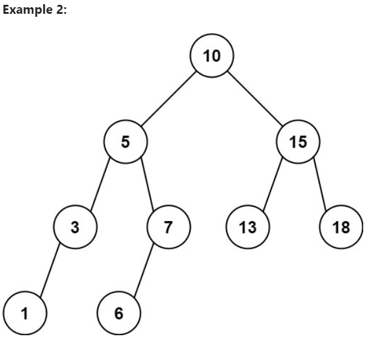

이진 탐색 트리의 루트 노드와 두 개의 정수 `low`와 `high`가 주어지면, 값이 `[low, high]` 범위 내에 있는 모든 노드의 값을 합산하여 반환합니다.

## 예제 1:
  
입력: root = [10,5,15,3,7,null,18], low = 7, high = 15  
출력: 32  
설명: 노드 7, 10, 그리고 15는 [7, 15] 범위 내에 있습니다. 7 + 10 + 15 = 32.

## 예제 2
  
입력: root = [10,5,15,3,7,13,18,1,null,6], low = 6, high = 10  
출력: 23  
설명: 노드 6, 7, 그리고 10은 [6, 10] 범위 내에 있습니다. 6 + 7 + 10 = 23.

## 제약 조건:
트리의 노드 수는 `[1, 2 * 104]` 범위에 있습니다.  
`1 <= Node.val <= 105`  
`1 <= low <= high <= 105`  
모든 `Node.val`은 고유합니다.