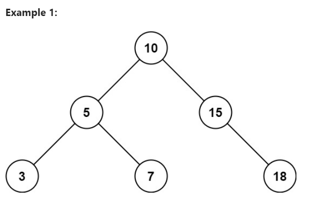

이진 탐색 트리의 루트 노드와 두 개의 정수 `low`와 `high`가 주어지면, 값이 `[low, high]` 범위 내에 있는 모든 노드의 값을 합산하여 반환합니다.

## 예제 1:
  
입력: root = [10,5,15,3,7,null,18], low = 7, high = 15  
출력: 32  
설명: 노드 7, 10, 그리고 15는 [7, 15] 범위 내에 있습니다. 7 + 10 + 15 = 32.

## 예제 2
  
입력: root = [10,5,15,3,7,13,18,1,null,6], low = 6, high = 10  
출력: 23  
설명: 노드 6, 7, 그리고 10은 [6, 10] 범위 내에 있습니다. 6 + 7 + 10 = 23.


## 제약 조건:
트리의 노드 수는 `[1, 2 * 104]` 범위에 있습니다.  
`1 <= Node.val <= 105`  
`1 <= low <= high <= 105`  
모든 `Node.val`은 고유합니다.


---
---
---
---
---
`rangeSumBST` 메서드는 주어진 이진 탐색 트리(BST)에서 특정 범위 `[low, high]` 내의 모든 노드 값의 합을 계산하는 문제를 해결합니다. 이 문제를 해결하기 위해 재귀적인 접근 방식을 사용했습니다. 아래는 이 접근 방식의 주요 아이디어와 단계별 설명입니다.

### 주요 아이디어
1. **BST의 특성 활용**: BST는 왼쪽 자식 노드가 부모 노드보다 작고, 오른쪽 자식 노드가 부모 노드보다 큰 특성을 가집니다. 이 특성을 활용하여 불필요한 부분을 탐색하지 않도록 합니다.
2. **재귀적 탐색**: 각 노드를 방문하면서 해당 노드의 값이 주어진 범위 내에 있는지 확인하고, 범위 내에 있다면 값을 합산합니다. 그런 다음, 범위에 따라 왼쪽 또는 오른쪽 자식 노드를 재귀적으로 탐색합니다.

### 단계별 설명
1. **기저 조건**: 현재 노드가 `null`인 경우, 0을 반환합니다. 이는 트리의 끝에 도달했음을 의미합니다.
   ```java
   if (root == null) {
       return 0;
   }
   ```

2. **현재 노드 값 확인 및 합산**: 현재 노드의 값이 `low`와 `high` 사이에 있는지 확인하고, 범위 내에 있다면 `sum`에 더합니다.
   ```java
   int sum = 0;
   if (root.val >= low && root.val <= high) {
       sum += root.val;
   }
   ```

3. **왼쪽 자식 노드 탐색**: 현재 노드의 값이 `low`보다 큰 경우, 왼쪽 자식 노드를 탐색합니다. 이는 왼쪽 자식 노드가 더 작은 값을 가지므로, 범위 내의 값을 찾기 위해 필요합니다.
   ```java
   if (root.val > low) {
       sum += rangeSumBST(root.left, low, high);
   }
   ```

4. **오른쪽 자식 노드 탐색**: 현재 노드의 값이 `high`보다 작은 경우, 오른쪽 자식 노드를 탐색합니다. 이는 오른쪽 자식 노드가 더 큰 값을 가지므로, 범위 내의 값을 찾기 위해 필요합니다.
   ```java
   if (root.val < high) {
       sum += rangeSumBST(root.right, low, high);
   }
   ```

5. **결과 반환**: 최종적으로 합산된 값을 반환합니다.
   ```java
   return sum;
   ```

### 전체 코드
```java
public static int rangeSumBST(TreeNode root, int low, int high) {
    if (root == null) {
        return 0;
    }

    int sum = 0;
    if (root.val >= low && root.val <= high) {
        sum += root.val;
    }

    if (root.val > low) {
        sum += rangeSumBST(root.left, low, high);
    }

    if (root.val < high) {
        sum += rangeSumBST(root.right, low, high);
    }

    return sum;
}
```

이 접근 방식은 BST의 특성을 잘 활용하여 불필요한 탐색을 줄이고, 효율적으로 범위 내의 값을 합산할 수 있도록 합니다.