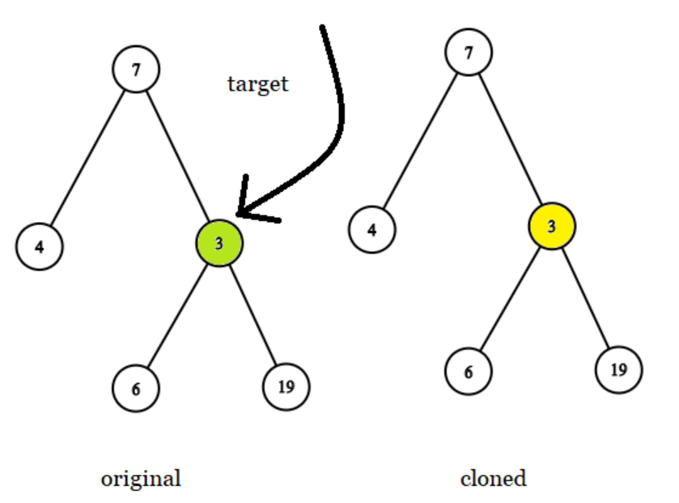
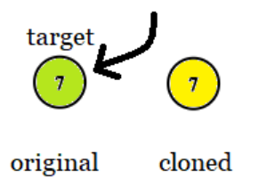
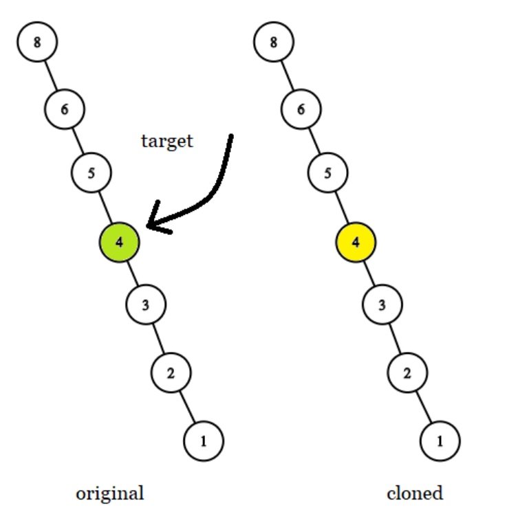

원본 트리(`original`)와 클론 트리(`cloned`)가 주어지고 원본 트리에서 노드 `target`에 대한 참조가 주어졌을 때,  
클론된 트리는 원본 트리의 복사본입니다.  
클론된 트리에서 동일한 노드에 대한 참조를 반환합니다.  
두 트리나 대상 노드를 변경할 수 없으며 답변은 클론된 트리의 노드에 대한 참조여야 합니다.


### 예제 1:


입력: tree = [7,4,3,null,null,6,19]  
target = 3  
출력: 3  
설명: 모든 예제에서 원본과 클론된 트리가 표시됩니다. 대상 노드는 원본 트리의 녹색 노드입니다. 답변은 클론된 트리의 노란색 노드입니다.

### 예제 2:  


입력: tree = [7], target =  7  
출력: 7

### 예제 3:


입력: tree = [8,null,6,null,5,null,4,null,3,null,2,null,1], target = 4  
출력: 4


### 제한사항:

트리의 노드 수는 `[1, 10^4]` 범위에 있습니다.  
트리의 노드 값은 고유합니다.  
대상 노드는 원본 트리의 노드이며 null이 아닙니다.  


추가 질문: 트리에서 반복된 값이 허용되는 경우 문제를 해결할 수 있습니까?


---

동적으로 트리를 구성하고 타겟 노드를 설정하는 방법을 보여드리겠습니다. 이를 위해 사용자 입력을 받아 트리를 구성하고 타겟 노드를 설정하는 코드를 작성할 수 있습니다. 예를 들어, 콘솔 입력을 통해 트리의 노드 값을 입력받고 타겟 노드를 설정하는 방법을 사용할 수 있습니다.

다음은 Java로 구현한 코드입니다:

```java
import java.util.Scanner;

public class Solution {
    public static class TreeNode {
        int val;
        TreeNode left;
        TreeNode right;

        public TreeNode(int val) {
            this.val = val;
        }
    }

    public final TreeNode getTargetCopy(final TreeNode original, final TreeNode cloned, final TreeNode target) {
        if (original == null) {
            return null;
        }
        if (original == target) {
            return cloned;
        }

        TreeNode leftResult = getTargetCopy(original.left, cloned.left, target);
        if (leftResult != null) {
            return leftResult;
        }

        return getTargetCopy(original.right, cloned.right, target);
    }

    public static TreeNode buildTree(Scanner scanner) {
        System.out.print("Enter node value (-1 for null): ");
        int val = scanner.nextInt();
        if (val == -1) {
            return null;
        }
        TreeNode node = new TreeNode(val);
        System.out.println("Enter left child of " + val);
        node.left = buildTree(scanner);
        System.out.println("Enter right child of " + val);
        node.right = buildTree(scanner);
        return node;
    }

    public static TreeNode findTarget(TreeNode root, int targetVal) {
        if (root == null) {
            return null;
        }
        if (root.val == targetVal) {
            return root;
        }
        TreeNode leftResult = findTarget(root.left, targetVal);
        if (leftResult != null) {
            return leftResult;
        }
        return findTarget(root.right, targetVal);
    }

    public static void main(String[] args) {
        Scanner scanner = new Scanner(System.in);

        System.out.println("Build the original tree:");
        TreeNode original = buildTree(scanner);

        System.out.println("Build the cloned tree:");
        TreeNode cloned = buildTree(scanner);

        System.out.print("Enter the target node value: ");
        int targetVal = scanner.nextInt();
        TreeNode target = findTarget(original, targetVal);

        if (target == null) {
            System.out.println("Target node not found in the original tree.");
        } else {
            Solution solution = new Solution();
            TreeNode result = solution.getTargetCopy(original, cloned, target);
            System.out.println("Corresponding node in cloned tree: " + result.val);
        }

        scanner.close();
    }
}
```

### 설명:
1. **TreeNode 클래스**: 이 클래스는 이진 트리의 노드를 나타내며, 노드의 값을 초기화하는 생성자를 포함합니다.
2. **getTargetCopy 메서드**: 이전 설명과 동일하게, 원본 트리와 복제된 트리를 동시에 깊이 우선 탐색(DFS)하여 타겟 노드를 찾습니다.
3. **buildTree 메서드**: 이 메서드는 사용자 입력을 통해 트리를 동적으로 구성합니다. 노드 값을 입력받고, -1을 입력하면 null 노드를 반환합니다.
4. **findTarget 메서드**: 이 메서드는 주어진 값에 해당하는 타겟 노드를 원본 트리에서 찾습니다.
5. **main 메서드**:
    - `Scanner`를 사용하여 사용자 입력을 받습니다.
    - `buildTree` 메서드를 호출하여 원본 트리와 복제된 트리를 구성합니다.
    - 타겟 노드의 값을 입력받고, `findTarget` 메서드를 사용하여 원본 트리에서 타겟 노드를 찾습니다.
    - 타겟 노드를 찾으면 `getTargetCopy` 메서드를 호출하여 복제된 트리에서 대응하는 노드를 찾고, 그 값을 출력합니다.

이 코드는 사용자 입력을 통해 트리를 동적으로 구성하고 타겟 노드를 설정하는 방법을 보여줍니다.