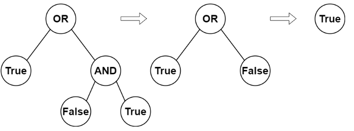

다음과 같은 속성을 가진 완전 이진 트리의 루트가 주어집니다:

- 리프 노드는 값이 `0` 또는 `1`이며, `0`은 `False`를 나타내고 `1`은 `True`를 나타냅니다.
- 리프 노드가 아닌 노드는 값이 `2` 또는 `3`이며, `2`는 boolean `OR`을 나타내고 `3`은 boolean `AND`를 나타냅니다.

노드의 평가 방법은 다음과 같습니다:

- 노드가 리프 노드인 경우, 평가 값은 노드의 값(`True` 또는 `False`)입니다.
- 그렇지 않은 경우, 노드의 두 자식을 평가하고 그 자식들의 평가 값을 사용하여 노드의 값을 boolean 연산합니다.

루트 노드를 평가한 boolean 결과를 반환합니다.

완전 이진 트리는 각 노드가 `0` 또는 `2`개의 자식을 가지는 이진 트리입니다.

리프 노드는 자식이 없는 노드입니다.

### 예제 1:

**입력:** root = [2,1,3,null,null,0,1]  
**출력:** true  
**설명:** 위의 그림은 평가 과정을 설명합니다.  
AND 노드는 False AND True = False로 평가됩니다.  
OR 노드는 True OR False = True로 평가됩니다.  
루트 노드는 True로 평가되므로 true를 반환합니다.

### 예제 2:

**입력:** root = [0]  
**출력:** false  
**설명:** 루트 노드는 리프 노드이며 false로 평가되므로 false를 반환합니다.

### 제약 조건:

- 트리의 노드 수는 `[1, 1000]` 범위입니다.
- `0 <= Node.val <= 3`
- 모든 노드는 `0` 또는 `2`개의 자식을 가집니다.
- 리프 노드는 값이 `0` 또는 `1`입니다.
- 리프 노드가 아닌 노드는 값이 `2` 또는 `3`입니다.
