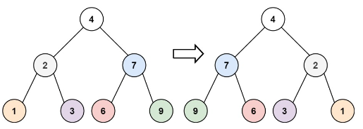
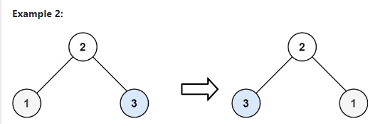

주어진 이진 트리의 루트를 기준으로 트리를 반전시킨 후, 그 루트를 반환하세요.

### 예제 1:

**입력:** `root = [4,2,7,1,3,6,9]`  
**출력:** `[4,7,2,9,6,3,1]`

### 예제 2:

**입력:** `root = [2,1,3]`  
**출력:** `[2,3,1]`

### 예제 3:

**입력:** `root = []`  
**출력:** `[]`

### 제한 사항:

- 트리의 노드 수는 `[0, 100]` 범위에 있습니다.
- `-100 <= Node.val <= 100`
