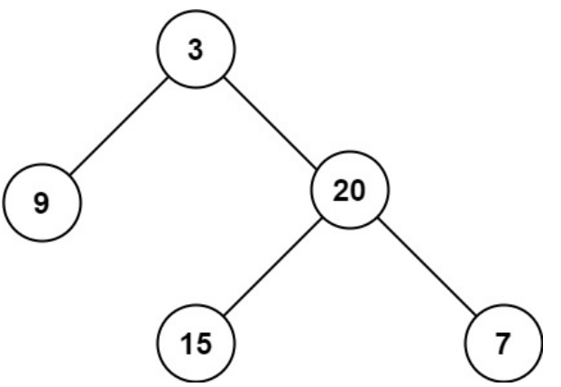

이진 트리의 루트가 주어졌을 때, **최대 깊이**를 반환합니다.

이진 트리의 최대 깊이는 루트 노드부터 가장 먼 리프 노드까지의 가장 긴 경로에 있는 노드 수입니다.

### 예시 1:
  
입력: root = [3,9,20,null,null,15,7]  
출력: 3  

### 예시 2:
입력: root = [1,null,2]  
출력: 2

### 제약 조건:
- 트리의 노드 수는 `[0, 10^4]` 범위에 있습니다.  
- `-100 <= Node.val <= 100`
