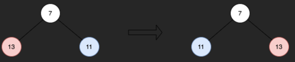

완벽한 이진 트리(root)가 주어졌을 때, 트리의 홀수 레벨에서 각 노드 값을 반전하세요.

예를 들어, 레벨 3의 노드 값이 `[2,1,3,4,7,11,29,18]`이라면, `[18,29,11,7,4,3,1,2]`가 되어야 합니다.
반전된 트리의 root를 반환하세요.

부모 노드가 모두 두 개의 자식을 가지고 모든 리프 노드가 동일한 레벨에 있는 경우, 이진 트리는 완벽합니다.

노드의 레벨은 해당 노드와 루트 노드 사이의 경로를 따라 이동하는 데 필요한 엣지(edge)의 수입니다.

### 예시 1

Input:  
root = [2,3,5,8,13,21,34]  
Output:  [2,5,3,8,13,21,34]  
설명:  
트리는 홀수 레벨만 가집니다.  
1단계에서 노드는 각각 3, 5이고, 이들은 반전되어 5, 3이 됩니다.

### 예시 2

Input:   
root = [7,13,11]  
Output: [7,11,13]  
설명:  
1단계에서 노드는 각각 13, 11이고, 이들은 반전되어 11, 13이 됩니다.

### 예시 3
Input: root = [0,1,2,0,0,0,0,1,1,1,1,2,2,2,2]  
Output: [0,2,1,0,0,0,0,2,2,2,2,1,1,1,1]  
설명:  
홀수 레벨에는 0이 아닌 값이 있습니다.  
1단계에서 노드는 각각 1, 2이었고, 반전 후에는 2, 1이 됩니다.  
3단계에서 노드는 각각 1, 1, 1, 1, 2, 2, 2, 2이었고, 반전 후에는 2, 2, 2, 2, 1, 1, 1, 1이 됩니다.  

제한사항:

트리의 노드 수는 `[1, 2^14]` 범위 내에 있습니다.  
`0 <= Node.val <= 105`  
`root`는 완벽한 이진 트리입니다.  
