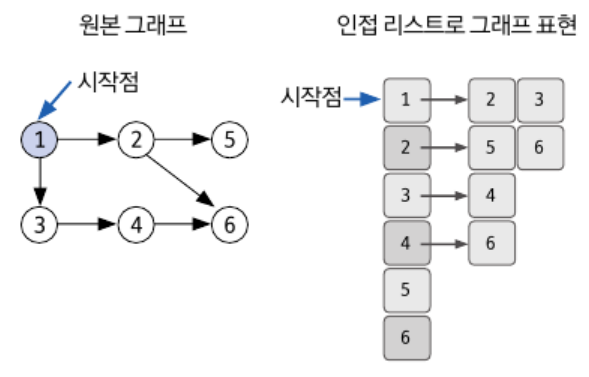

# DFS (Depth-First Search)
- 검색,탐색 알고리즘 중 하나
- 자료구조: 그래프,트리

- 시작 노드에서 자식의 노드들을 순서대로 탐색하면서 깊이를 우선으로 탐색하는 알고리즘
- 모든 경우의 수를 탐색하기 때문에, **완전탐색 알고리즘**[^2], **비 선형 구조 탐색**[^3]
- DFS는 주로 반복문을 활용하거나, 재귀문을 통하여 구현된다. (재귀함수를 이용하므로 **stack overflow**에 유의해야 한다.)[^1]
- 기본 탐색 과정은 특정 정점에서 시작하여 역추적(backtracking) 하기 전에 각 분기를 따라 가능한 한 멀리 탐색하는 것
  - 현재 노드를 방문한 것으로 표시한다.
  - 방문한 표시가 되어 있지 않은 각각의 인접한 정점을 탐색한다. 
  - 더 이상 방문하지 않은 정점이 없으면 이전 정점으로 역추적(backtracking) 한다. 
  - 모든 정점을 방문할 때까지 프로세스를 반복한다.
- 깊이 우선 탐색을 응용하여 풀 수 있는 문제는 단절점 찾기, 단절선 찾기, 사이클 찾기, 위상 정렬 등이 있습니다.

### 깊이 우선 탐색이란 루트 노드(혹은 다른 임의의 노드)에서 시작해서 다음 분기(branch)로 넘어가기 전에 해당 분기를 완벽하게 탐색하는 방법
- 미로를 탐색할 때 한 방향으로 갈 수 있을 때까지 계속 가다가 더 이상 갈 수 없게 되면 다시 가장 가까운 갈림길로 돌아와서 이곳으로부터 다른 방향으로 다시 탐색을 진행하는 방법과 유사하다.
- 즉, 넓게(wide) 탐색하기 전에 깊게(deep) 탐색하는 것이다.
- 사용하는 경우: 모든 노드를 방문 하고자 하는 경우에 이 방법을 선택한다.
- 깊이 우선 탐색(DFS)이 너비 우선 탐색(BFS)보다 좀 더 간단하다.
- 단순 검색 속도 자체는 너비 우선 탐색(BFS)에 비해서 느리다

깊이 우선 탐색(DFS)의 특징
- 자기 자신을 호출하는 순환 알고리즘의 형태 를 가지고 있다.
- 전위 순회(Pre-Order Traversals)를 포함한 다른 형태의 트리 순회는 모두 DFS의 한 종류이다.
- 그래프 탐색의 경우 어떤 노드를 방문했었는지 여부를 반드시 검사 해야 한다.
  - 이를 검사하지 않을 경우 무한루프에 빠질 위험이 있다.

## DFS의 장단점
### DFS의 장점
1. DFS는 현재 순회 중인 정점만 저장하는 스택 데이터 구조(현재 경로상의 노드들만 기억하면 되므로)를 사용하기 때문에 BFS에 비해 메모리 공간을 덜 차지한다.
2. DFS는 목표가 특정 정점(또는 모든 정점)에 최대한 빨리 도달하는 것일 때 유용하다.
3. DFS를 사용하여 그래프에서 순환을 감지할 수 있다.
### DFS의 단점
1. 순환 그래프의 경우 DFS가 무한 루프에 빠질 수 있다.
2. DFS는 두 정점 사이의 최단 경로를 찾으려는 경우 사용하기에 가장 좋은 알고리즘이 아닐 수 있다.
3. DFS는 특정 시나리오에서 매우 유용할 수 있지만 항상 최선의 선택은 아니다. 해결하려는 특정 문제에 따라 BFS(Breadth-first Search)와 같은 다른 알고리즘이 더 적합할 수 있다.
4. DFS는 해를 구하면 탐색이 종료된다. 따라서 구한 해가 최적의 해가 아닐 수 있다.
5. 단순 검색 속도 자체는 너비 우선 탐색(BFS)에 비해서 느립니다.

---
### 참고
1. 인접행렬(adjacency matrix)
> - node와 edge의 정보를 행렬로 표현하는 방법으로, edge와 상관없이 모든 node를 표현해야 하기 때문에 node의 수가 많을수록 메모리 사용량이 늘어난다. (node의 개수만큼 반복문을 돌아야 하기 때문)  
> - 노드의 개수가 많고, 간선 수가 적을 때 유리하다.

2. 인접 리스트(adjacency list)
> - node와 edge의 정보를 리스트로 표현하는 방법으로, 연결된 것만 표시하므로 인접행렬에 비해 간단
> - 노드의 개수가 적고, 간선 수가 많을 때 유리하다.

|           | 인접 리스트                   | 인접 행렬  |
|-----------|--------------------------|--------|
| 특정 간선 검색  | O(degree(N)) : 해당 노드의 차수 | O(1)   |
| 정점의 차수 계산 | O(degree(N))             | O(N)   |
| 전체 노드 탐색  | O(E)                     | O(N^2) |
| 시간복잡도     | O(N+E)                   | O(N^2) |
- 노드 수: N, 에지 수 E

# Graph 주요 용어

- **vertex**: 정점
- **edge**: 간선 (정점과 정점을 연결한 선)
- **color**: 정점에 색깔을 부여하여 방문 상태를 확인하는 용도
    - **white vertex**: 아직 방문된 적이 없는 정점
    - **gray vertex**: 방문은 되었지만 인접한 정점들 중에 white vertex가 존재, 즉 더 이상 탐색이 가능한 정점의 상태
    - **black vertex**: 인접한 모든 정점 중 white vertex가 없음, 즉 더 이상 탐색이 불가능한 정점의 상태
- **선행자 (π)**: 부모 정점을 저장하는 용도
- **d (distance)**: 정점까지의 거리
- **back tracking**: 더 나아갈 정점이 없으면 부모 정점으로 이동하여 다시 그 정점에서 DFS를 수행하는 과정

- **간선의 종류**
    - **트리간선 (Tree Edge)**: DFS의 결과로 완성된 트리의 모든 간선들
    - **역행간선 (Back Edge)**: 트리에서 자식이 조상을 연결하는 간선들
    - **순행간선 (Forward Edge)**: 트리에서 조상이 자식을 연결하는 Tree Edge가 아닌 간선들
    - **교차간선 (Cross Edge)**: 이 외의 나머지 모든 간선들

---
[^1]: 스택 오버플로우(stack overflow)는 지정한 스택 메모리 사이즈보다 더 많은 스택 메모리를 사용하게 되어 에러가 발생하는 상황을 일컫는다.

[^2]: 완전 탐색(Exhaustive Search)

- 알고리즘에서 사용되는 기법 중 하나로 ‘모든 가능한 경우의 수를 탐색’하여 ‘최적의 결과를 찾는 방법’을 의미합니다.

- 모든 가능성을 고려하기 때문에 항상 최적의 해를 찾을 수 있지만 경우의 수가 매우 많은 경우 시간과 메모리의 부담이 커질 수 있습니다. 그렇기에 문제의 특성에 따라 다른 탐색 기법을 사용하는 것이 좋습니다.

[^3]: 비선형 구조(Non Linear)

- 데이터를 저장하기 위한 방법으로 데이터 간의 관계를 이루면서 ‘계층적인 구조‘를 가지며 ‘일렬로 나열되지 않은 자료구조’ 형태를 의미합니다.
- 일련 되지 않은 자료구조는 계층적으로 데이터의 관계가 부모-자식 관계, 연결 관계, 또는 소속 관계 등을 가지고 있어서 계층적이거나 상호 연결되어 있습니다.
- 대표적인 비선형 구조는 트리(Tree), 그래프(Graph)등이 이에 해당합니다.