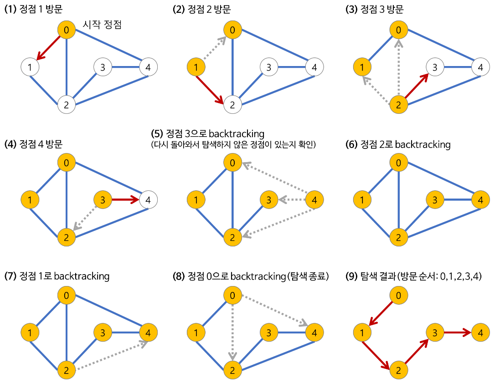

# DFS 과정

1. 먼저 `0` 정점을 시작으로 `1` 정점을 방문한다.
2. `1` 정점에 연결된 모든 정점을 조사하고 방문되지 않은 정점(`2`)을 방문한다.
3. 2번과 같은 방식으로 `3` 정점을 방문한다.
4. 똑같이 `4` 정점을 방문한다.
5. `4` 정점에서 탐색하지 않은 정점이 있는지 확인하고 없으므로 본인이 왔던 `3` 정점으로 backtracking 한다.
6. `3` 정점이 왔던 `2` 정점으로 backtracking
7. `2` 정점이 왔던 `1` 정점으로 backtracking
8. `1` 정점이 왔던 `0` 정점으로 backtracking
9. 탐색 종료 (방문 순서: 0, 1, 2, 3, 4)