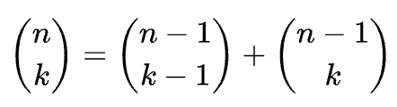

정수 `numRows`가 주어지면, 파스칼의 삼각형의 처음 numRows를 반환합니다.

파스칼의 삼각형에서 각 숫자는 바로 위의 두 숫자의 합으로 표시됩니다.

## 예시 1:
입력: numRows = 5  
출력: [[1],[1,1],[1,2,1],[1,3,3,1],[1,4,6,4,1]]

## 예시 2:
입력: numRows = 1  
출력: [[1]]

제약 조건:
`1 <= numRows <= 30`

## Pascal

간단히 말하자면, 파스칼의 삼각형은 다음과 같은 방법으로 만들 수 있다.

1. 첫 번째 줄에는 1을 쓴다.
2. 그 다음 줄을 만들 때 바로 위의 왼쪽 숫자와 오른쪽 숫자를 더한다(오른쪽 그림 참고). 예를 들어, 네 번째 줄의 숫자 1과 3을 더하여 다섯 번째 줄의 4가 만들어진다.

파스칼의 법칙을 이용해 이 규칙을 아래와 같이 수학적으로 표현할 수 있다. n 번째 줄의 k 번째 값을 𝑎𝑛𝑘 (n, k >= 0) 라고 할 때,

$𝑎_{𝑛1} = 1$  
$𝑎{𝑛𝑛} = 1$  
$𝑎{𝑛𝑘} = 𝑎{𝑛−1𝑘−1} + 𝑎{𝑛−1𝑘}$ 

이때  

