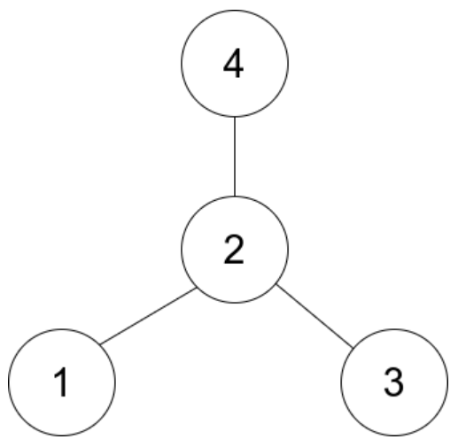

n개의 노드로 레이블링된 무방향 별 그래프가 있습니다. 
별 그래프는 하나의 중심 노드와 중심 노드와 다른 모든 노드를 연결하는 정확히 `n - 1`개의 간선이 있는 그래프입니다.

edges라는 2차원 정수 배열이 주어지는데, 
각 $`edges[i] = [u_i, v_i]`$는 노드 $`u_i`$와 $`v_i`$ 사이에 간선이 있다는 것을 나타냅니다. 
주어진 별 그래프의 중심을 반환하세요.

### 예시 1:
입력: edges = [[1,2],[2,3],[4,2]]  
출력: 2  
설명: 위 그림에서 보듯이, 노드 2는 다른 모든 노드와 연결되어 있으므로 2가 중심입니다.  

### 예시 2:
입력: edges = [[1,2],[5,1],[1,3],[1,4]]  
출력: 1

### 제한 사항:
`3 <= n <= 105`  
`edges.length == n - 1`  
`edges[i].length == 2`   
$`1 <= u_i, v_i <= n`$  
$u_i$ != $v_i$  
주어진 edges는 유효한 별 그래프를 나타냅니다.
