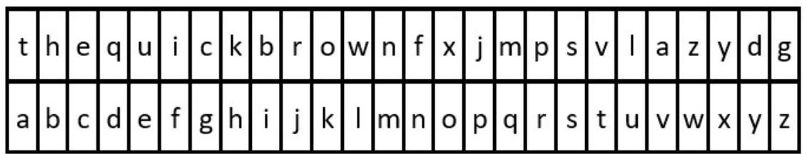
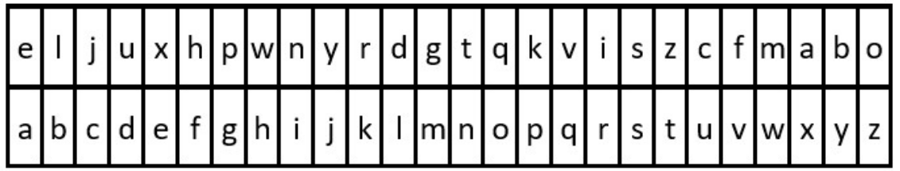

당신은 문자열 `key`와 `message`를 받았습니다. 
이 문자열들은 각각 암호 키와 비밀 메시지를 나타냅니다. `message`를 해독하는 단계는 다음과 같습니다:

1. `key`에서 처음 등장하는 모든 26개의 소문자 영어 알파벳을 사용하여 치환 테이블의 순서를 정합니다.
2. 치환 테이블을 일반 영어 알파벳과 정렬합니다.
3. `message`의 각 문자는 테이블을 사용하여 치환됩니다.
4. 공백 `' '`은 그대로 유지됩니다.

예를 들어, `key = "happy boy"` (실제 키는 알파벳의 각 문자가 최소 한 번씩 등장해야 합니다)인 경우, 
부분 치환 테이블은 `('h' -> 'a', 'a' -> 'b', 'p' -> 'c', 'y' -> 'd', 'b' -> 'e', 'o' -> 'f')`와 같습니다.

해독된 메시지를 반환합니다.

### 예제 1:

- **입력**: key = "the quick brown fox jumps over the lazy dog", message = "vkbs bs t suepuv"
- **출력**: "this is a secret"
- **설명**: 위의 다이어그램은 치환 테이블을 보여줍니다. 이는 "the quick brown fox jumps over the lazy dog"에서 각 문자가 처음 등장하는 순서로 얻어집니다.

### 예제 2:

- **입력**: key = "eljuxhpwnyrdgtqkviszcfmabo", message = "zwx hnfx lqantp mnoeius ycgk vcnjrdb"
- **출력**: "the five boxing wizards jump quickly"
- **설명**: 위의 다이어그램은 치환 테이블을 보여줍니다. 이는 "eljuxhpwnyrdgtqkviszcfmabo"에서 각 문자가 처음 등장하는 순서로 얻어집니다.

### 제약 조건:
- `26 <= key.length <= 2000`
- key는 소문자 영어 알파벳과 `' '`로 구성됩니다.
- key는 영어 알파벳 ('a'부터 'z'까지)의 모든 문자를 최소 한 번 포함합니다.
- `1 <= message.length <= 2000`
- `message`는 소문자 영어 알파벳과 ' '로 구성됩니다.
