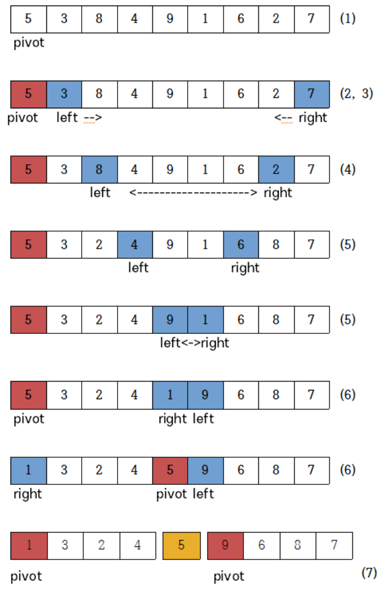
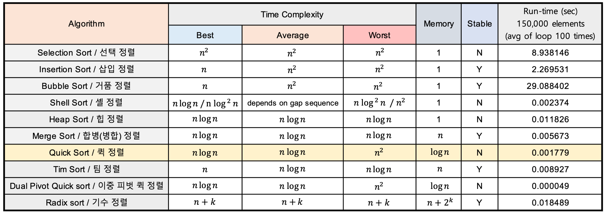

# 퀵 정렬 방법

1. 리스트 안에 있는 한 요소를 선택한다. 이렇게 고른 원소를 피벗(pivot) 이라고 한다. pivot 은 데이터를 나누는 기준점 이다.
2. left는 왼쪽에서 오른쪽으로 가면서 피봇보다 큰 수를 찾는다.
3. right는 오른쪽에서 왼쪽으로 가면서 피봇보다 작은 수를 찾는다.
4. 찾은 지점에서 left와 right를 교환한다.
5. 위의 2,3,4과정 left와 right가 교차할 때 까지 반복한다.
6. left와 right가 교차하면 피봇(pivot)과 right를 교환한다.
7. 이렇게 되면 피봇의 왼쪽에는 피봇보다 작은수가, 피봇의 오른쪽에는 피봇보다 큰 수가 위치한다.
8. 피봇을 기준으로 왼쪽과 오른쪽 리스트 두개로 나눠 위의 과정을 반복 수행(**재귀**)한다.(Divide : 분할)
9. 이렇게 순환 과정을 통해 분할된 리스트의 크기가 0이나 1이 되면 수행을 종료한다.

---
### 참조
👉🏻 [NaverD2 - Tim sort에 대해 알아보기](https://d2.naver.com/helloworld/0315536)  
👉 [Java - Tim Sort](https://st-lab.tistory.com/276)  
👉 [어떤 정렬 알고리즘을 사용할까?](https://velog.io/@disdos0928/%EC%96%B4%EB%96%A4-%EC%A0%95%EB%A0%AC-%EC%95%8C%EA%B3%A0%EB%A6%AC%EC%A6%98%EC%9D%84-%EC%82%AC%EC%9A%A9%ED%95%A0%EA%B9%8C)  
👉 [Java - Quick Sort](https://st-lab.tistory.com/250)

# 질문
- 퀵 정렬이 최악의 시간복잡도를 가지는 경우는?